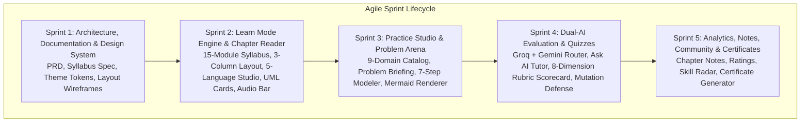

# Agile Delivery Plan & Sprint Backlog

This document outlines the sprint structure, user stories, acceptance criteria, and delivery roadmap for DesignLoop.

---

## 1. Epics & Story Points

| Epic | Name | Scope | Points |
| :--- | :--- | :--- | :---: |
| EPIC-01 | Architecture, Docs & Design Tokens | PRD, Curriculum Syllabus, Design Tokens, Architecture Spec | 8 |
| EPIC-02 | Learn Track | 15-Module Sidebar, Chapter Reader, UML Cards, 5-Language Studio, Audio Waveform | 21 |
| EPIC-03 | Practice Arena & 7-Step Studio | 9-Domain Catalog, Problem Briefing, 7-Step Studio, Fast-Fail Checks | 21 |
| EPIC-04 | AI Orchestration & Evaluator | Dual-LLM Router, Ask AI Tutor, 8-Dimension Rubric, Mutation Engine | 13 |
| EPIC-05 | Community, Notes & Progress | Chapter Notes, Star Ratings, Skill Radar, Certificate Export | 13 |

---

## 2. User Stories

### EPIC-02: Learn Track

#### US-201: Collapsible Syllabus Sidebar
- **As a** learner,
- **I want to** navigate through 15 organized modules and 137 chapters with instant search and completion tracking,
- **So that** I can monitor my progress toward certification.
- **Acceptance Criteria:**
  - *Given* I am on the Learn page,
  - *When* I view the left sidebar,
  - *Then* I see `0% Certificate (0/137)`, 15 collapsible modules with completion badges, and a working search filter.

#### US-202: 5-Language Code Studio with Simulated Output
- **As a** developer preparing in my language of choice,
- **I want to** switch between Java, Python, C++, TypeScript, and Go code snippets with simulated execution output,
- **So that** I can understand idiomatic implementations of each design pattern.
- **Acceptance Criteria:**
  - *Given* I am reading a chapter,
  - *When* I click a language tab,
  - *Then* the syntax-highlighted code updates instantly with line numbers, a copy button, and realistic stdout output.

#### US-203: Audio Chapter Player Bar
- **As a** developer who learns through audio,
- **I want to** listen to a chapter overview with waveform visualization and speed controls,
- **So that** I can absorb concepts on the go.
- **Acceptance Criteria:**
  - *Given* a chapter with an audio script,
  - *When* I press Play,
  - *Then* the waveform animates, progress updates, and speed toggles between 1x, 1.25x, 1.5x, and 2x.

---

### EPIC-03: Practice Arena & 7-Step Studio

#### US-301: 9-Domain Problem Catalog
- **As a** candidate practicing for interviews,
- **I want to** browse 35+ industry problems organized by domain with company tags and difficulty indicators,
- **So that** I can target company-specific design challenges.
- **Acceptance Criteria:**
  - *Given* I am in Practice mode,
  - *When* I select domain tabs or search,
  - *Then* problems show company tags (Google, Amazon, Meta, Uber), difficulty badges, and estimated times.

#### US-302: 7-Step Interactive Architecture Studio
- **As a** candidate designing an LLD solution,
- **I want to** follow a structured 7-step workflow (Clarify → Assumptions → UML → Pre-Checks → AI Rubric → Mutation),
- **So that** I practice structured architectural reasoning rather than jumping straight to code.
- **Acceptance Criteria:**
  - *Given* an active problem attempt,
  - *When* I model classes and methods,
  - *Then* a live Mermaid diagram renders immediately, deterministic checks run before AI evaluation, and I receive an 8-dimension scorecard.

---

### EPIC-04: AI Orchestration & Evaluator

#### US-401: Dual-AI Router & Ask AI Tutor
- **As a** student with questions about a chapter,
- **I want to** ask the contextual AI tutor and receive grounded explanations,
- **So that** I can clarify design trade-offs in real time.
- **Acceptance Criteria:**
  - *Given* any chapter or problem step,
  - *When* I open "Ask AI",
  - *Then* Groq (Llama 3.3) provides fast streaming responses grounded in the chapter's concepts.

#### US-402: 8-Dimension AI Rubric & Mutation Defense
- **As a** candidate submitting a design,
- **I want to** receive an evidence-backed scorecard grading Requirements, SRP, Coupling, Encapsulation, Patterns, Extensibility, Edge Cases, and Explanation Quality,
- **So that** I know exactly what to improve next.
- **Acceptance Criteria:**
  - *Given* a validated UML class submission,
  - *When* I submit for evaluation,
  - *Then* Google Gemini 2.5 Flash outputs structured scores with direct evidence quotes and actionable suggestions.
