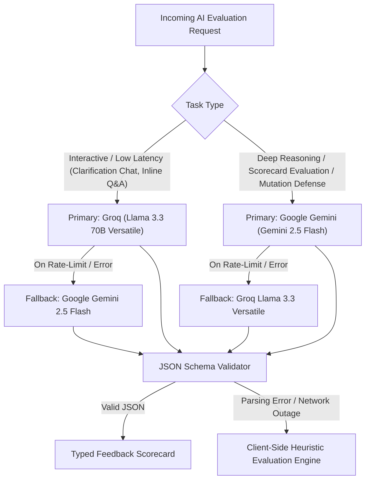

# AI Integration & Evaluation Specification

## 1. AI System Overview

DesignLoop uses AI not as a generic chatbot, but as an evidence-grounded architectural evaluator. The platform adheres to strict separation between deterministic checks and semantic AI reasoning to ensure fast response times, zero loss of submission state, and consistent rubric-based feedback.

```
Candidate Submission
   │
   ├── 1. Deterministic Layer (Synchronous / Instant)
   │     ├── Schema & Required Field Completeness
   │     ├── State Transition (DRAFT → SUBMITTED → EVALUATING)
   │     └── Local & Remote State Caching
   │
   └── 2. Semantic AI Layer (Asynchronous / Resilient)
         ├── Task Router (Groq Llama 3.3 ↔ Gemini 2.5 Flash)
         ├── Fixed 8-Dimension Rubric Scoring
         ├── Direct Quote Evidence Extraction
         └── Fallback Engine (Client-Side Heuristic Fallback if API fails)
```

---

## 2. Deterministic vs. AI Separation

To maintain reliability, tasks are strictly categorized:

| Deterministic Checks (No AI) | Semantic AI Judgment |
| :--- | :--- |
| Required fields and structure presence | Cohesion and Single Responsibility Principle (SRP) quality |
| Syntax checks and AST validation | Information hiding, encapsulation, and boundary invariants |
| Submission lifecycle and idempotency | Appropriate justification for design patterns (Strategy, Factory, etc.) |
| Attempt history caching & local storage persistence | Resilience under requirement mutation challenges (OCP defense) |
| Duplicate submission suppression | Concrete suggestions, trade-offs, and next practice actions |

---

## 3. Dual-Provider Routing & Fallback Chain



### Routing Strategy
1. **Low-Latency Interactive Tasks (Groq Primary):** Real-time candidate interview clarification Q&A and contextual AI tutor queries.
2. **Deep Architectural Reasoning (Gemini Primary):** Full 8-dimension rubric evaluations, direct evidence extraction, and Requirement Mutation OCP stress-tests.
3. **Resilient Fallback:** If the primary provider encounters network issues or rate limits, the request automatically falls back to the secondary provider. If all external APIs are unreachable, a grounded client-side heuristic engine generates structured rubric feedback without blocking the candidate.

---

## 4. Fixed Rubric Schema & Prompt Engineering

To prevent hallucinated criteria and inconsistent scores, models are constrained by structured prompts and fixed JSON output schemas:

### A. 8-Dimension Evaluator System Prompt
```
You are a Principal Software Architect conducting an evidence-based Low-Level Design (LLD) interview evaluation.
You must evaluate the candidate's design against exactly 8 dimensions:
1. Requirement Understanding (Scope, assumptions, constraints)
2. Class Responsibilities (SRP, domain cohesion)
3. Coupling & Cohesion (Dependency direction, minimal concrete coupling)
4. Encapsulation & Interfaces (State protection, clean minimal APIs)
5. Patterns & Abstraction (Justified pattern usage protecting variation points)
6. Extensibility & Mutation Defense (Open/Closed Principle under change)
7. Edge Cases & Testability (Boundary conditions, error states, mockability)
8. Quality of Explanation (Trade-off articulation, clear design rationale)

Rules:
- For every criterion, you MUST quote direct evidence from the candidate's submission.
- Provide scores from 1 (poor) to 5 (excellent).
- Identify concrete architectural impact, actionable suggestions, and explicit trade-offs.
- Return output strictly adhering to the JSON schema.
```

### B. Output JSON Schema
```json
{
  "overallScore": 85,
  "overallSummary": "Clean domain modeling with strong separation of concerns. Spot allocation strategy is well decoupled via the Strategy pattern.",
  "confidence": "high",
  "criteria": [
    {
      "dimension": "Class Responsibilities",
      "score": 4,
      "maxScore": 5,
      "confidence": "high",
      "evidence": "ParkingLot delegates spot search to Floor and FeeCalculation to FeeCalculator interface.",
      "interpretation": "Strong cohesion; coordination logic is cleanly separated from fee policies.",
      "impact": "Reduces regression risk when payment rules change.",
      "suggestion": "Consider extracting TicketRepository into an interface to isolate persistence.",
      "tradeoff": "Adds one additional interface abstraction in exchange for complete storage decoupling.",
      "practiceAction": "Refactor ticket lookup to use an injected repository contract.",
      "severity": "positive"
    }
  ],
  "nextPracticeActions": [
    "Introduce optimistic locking or synchronized spot allocation to defend against concurrent entrance races."
  ],
  "recurringSmellsIdentified": [],
  "mutationReview": {
    "mutationTitle": "Dynamic Surge Pricing & Reserved VIP Spots",
    "changeCost": "Low",
    "ocpVerdict": "PASS",
    "explanation": "Existing PricingStrategy interface allows plugging in SurgePricingStrategy without modifying ParkingLot or Floor classes.",
    "filesModifiedCount": 0,
    "breakingChangesIdentified": []
  }
}
```

---

## 5. Candidate Guidance & Quality Criteria

DesignLoop evaluates architectural substance rather than boilerplate quantity:
- **Evidence-Grounded:** Feedback cites specific classes, methods, and invariants declared by the candidate.
- **Constructive Trade-Offs:** Explains *why* an abstraction is justified or when a simpler direct relationship is preferred over unnecessary design patterns.
- **Fail-Safe Integrity:** All evaluation snapshots are immutably persisted alongside candidate submissions.
