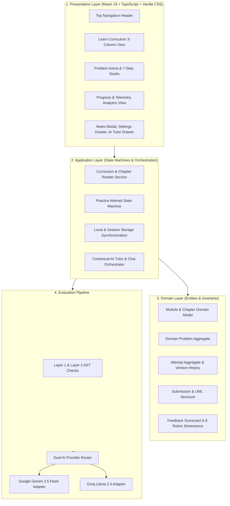
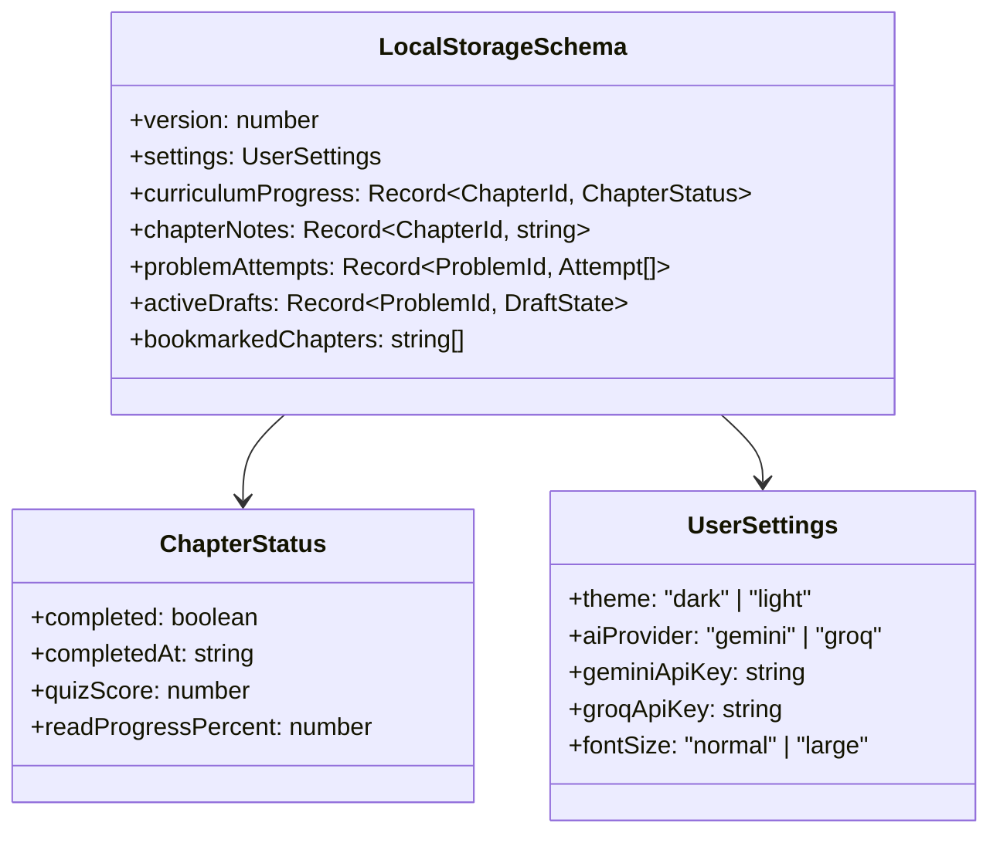
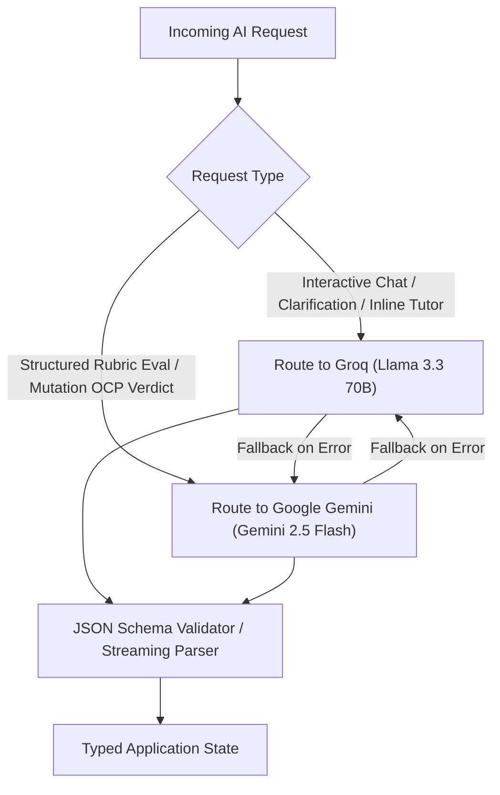

# System Architecture & Technical Design

---

## 1. Architecture Overview

DesignLoop follows Clean Architecture principles to separate domain logic, storage persistence, AI orchestration, and presentation components.



---

## 2. Core Domain Data Contracts (TypeScript)

#### A. Curriculum Chapter Entity
```typescript
export interface ChapterSection {
  id: string;
  title: string;
  content: string; // Markdown formatted
  callout?: {
    type: 'note' | 'tip' | 'warning' | 'important';
    title: string;
    text: string;
  };
}

export interface UMLClassCardData {
  className: string;
  stereotype?: 'interface' | 'abstract' | 'class' | 'enum';
  attributes: {
    visibility: '-' | '+' | '#';
    name: string;
    type: string;
  }[];
  methods: {
    visibility: '-' | '+' | '#';
    signature: string;
    returnType: string;
  }[];
}

export interface ChapterQuiz {
  id: string;
  question: string;
  options: string[];
  correctOptionIndex: number;
  explanation: string;
}

export interface CurriculumChapter {
  id: string;
  moduleId: string;
  title: string;
  slug: string;
  priority: 'High Priority' | 'Medium Priority' | 'Core';
  readTimeMinutes: number;
  lastUpdated: string;
  summary: string;
  sections: ChapterSection[];
  umlCard?: UMLClassCardData;
  codeSnippets: {
    java: string;
    python: string;
    cpp: string;
    typescript: string;
    go: string;
  };
  sampleOutput?: string;
  practicalExample?: {
    title: string;
    scenario: string;
    code: Record<string, string>;
    whyItWorks: string[];
  };
  quiz?: ChapterQuiz;
}

export interface CurriculumModule {
  id: string;
  title: string;
  description: string;
  iconName: string;
  chapterIds: string[];
}
```

#### B. Practice Problem Entity
```typescript
export interface Problem {
  id: string;
  slug: string;
  title: string;
  subtitle: string;
  domainCategory:
    | 'Games & Puzzles'
    | 'Data Structures & Search'
    | 'Managing States'
    | 'Management Systems'
    | 'Social & Content Platforms'
    | 'Communication & Messaging'
    | 'Financial & Payment Systems'
    | 'E-Commerce & Booking Systems'
    | 'Developer Tools & Infrastructure';
  difficulty: 'EASY' | 'MEDIUM' | 'HARD';
  estimatedMinutes: number;
  companies: string[];
  tags: string[];
  statement: string;
  functionalRequirements: string[];
  nonFunctionalConsiderations: string[];
  thingsToThinkAbout: string[];
  suggestedPatterns: string[];
  clarifications: {
    question: string;
    answer: string;
    rationale: string;
  }[];
  mutationScenario: {
    title: string;
    description: string;
    expectedImpact: string;
    ocpCriteria: string[];
  };
}
```

#### C. Evaluation Scorecard Data Model
```typescript
export interface RubricDimensionScore {
  dimension: string; // 'Requirement Understanding' | 'Class Responsibilities' | 'Coupling & Cohesion' | 'Encapsulation & Interfaces' | 'Patterns & Abstraction' | 'Extensibility' | 'Edge Cases & Testability' | 'Quality of Explanation'
  score: number; // 1 to 5
  maxScore: number; // 5
  confidence: 'high' | 'medium' | 'low';
  evidence: string; // Direct candidate submission quotes
  interpretation: string;
  impact: string;
  suggestion: string;
  tradeoff: string;
  practiceAction: string;
  severity: 'critical' | 'important' | 'positive';
}

export interface EvaluationScorecard {
  overallScore: number; // 0 to 100
  overallSummary: string;
  confidence: 'high' | 'medium' | 'low';
  criteria: RubricDimensionScore[];
  nextPracticeActions: string[];
  recurringSmellsIdentified: string[];
  mutationReview?: {
    mutationTitle: string;
    changeCost: 'Low' | 'Medium' | 'High';
    ocpVerdict: 'PASS' | 'PARTIAL' | 'FAIL';
    explanation: string;
    filesModifiedCount: number;
    breakingChangesIdentified: string[];
  };
}
```

---

## 3. State Persistence & LocalStorage Schemas



---

## 4. Dual-LLM Routing Strategy


