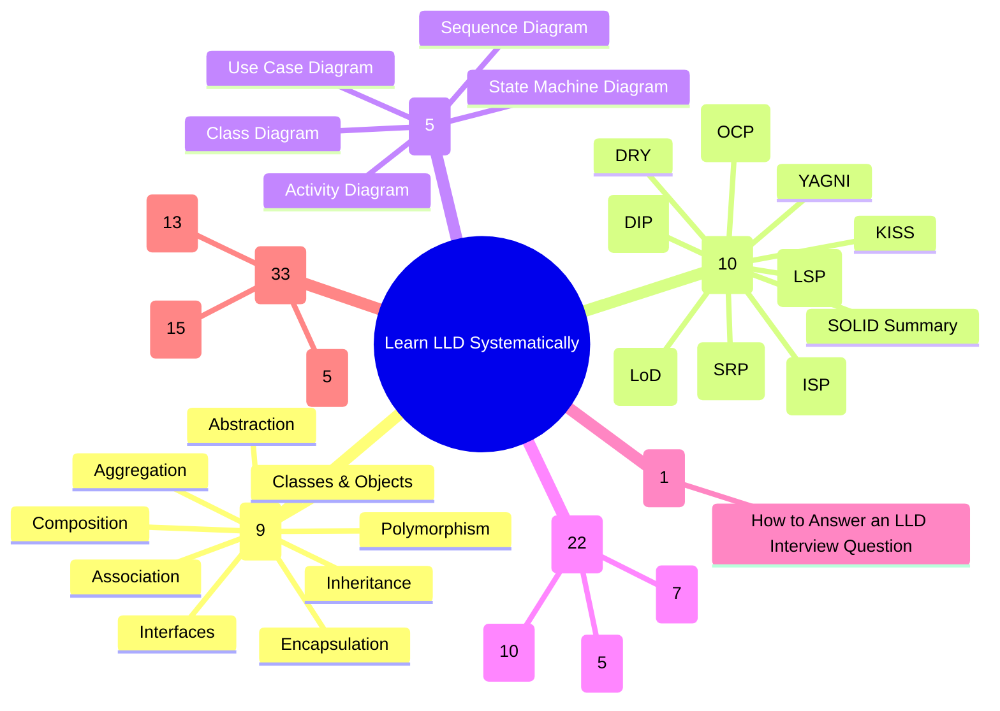
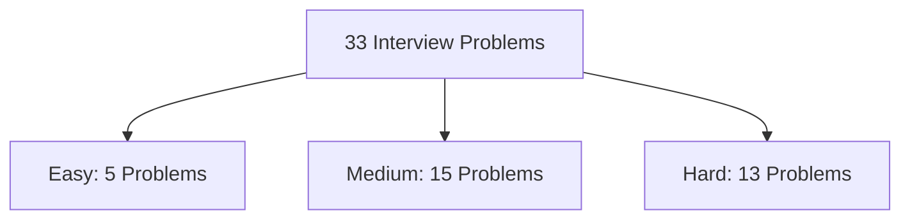

# Curriculum & Problem Catalog Master Specification

This document defines the complete catalog and taxonomy for **DesignLoop**, aligning with the systematic LLD mastery structure (80+ Core Concepts & Real-World Interview Problems).

---

## 1. Curriculum Structure & Taxonomy Overview

---

## 2. Comprehensive Module & Topic Breakdown

### A. Object Oriented Programming (9 Concepts)
| Topic ID | Concept | Category | Key Focus | Notes & Star |
| :--- | :--- | :--- | :--- | :---: |
| `oop-classes-objects` | **Classes & Objects** | Foundation | Blueprints vs Instances, state & behavior, memory allocation | Supported |
| `oop-interfaces` | **Interfaces** | Foundation | Contracts, polymorphism, multiple inheritance of type | Supported |
| `oop-inheritance` | **Inheritance** | Foundation | "Is-A" hierarchy, code reuse, method overriding, `super` | Supported |
| `oop-polymorphism` | **Polymorphism** | Foundation | Dynamic dispatch, method overloading vs overriding | Supported |
| `oop-abstraction` | **Abstraction** | Foundation | Information hiding, reducing complexity, abstract classes | Supported |
| `oop-encapsulation` | **Encapsulation** | Foundation | Data bundling, access modifiers (`private`, `protected`, `public`), invariant protection | Supported |
| `oop-aggregation` | **Aggregation** | Relationships | "Has-A" relationship with independent lifecycle (e.g. Department & Teacher) | Supported |
| `oop-composition` | **Composition** | Relationships | "Has-A" relationship with strictly dependent lifecycle (e.g. House & Room) | Supported |
| `oop-association` | **Association** | Relationships | General relationship between two peer objects (Unidirectional / Bidirectional) | Supported |

---

### B. Design Principles & SOLID (10 Concepts)
| Topic ID | Principle | Acronym | Core Architectural Intent | Notes & Star |
| :--- | :--- | :--- | :--- | :---: |
| `dp-dry` | **Don't Repeat Yourself** | DRY | Eliminate duplicate knowledge and business logic | Supported |
| `dp-kiss` | **Keep It Simple Stupid** | KISS | Avoid over-engineering; favor readable, direct implementations | Supported |
| `dp-yagni` | **You Aren't Gonna Need It** | YAGNI | Implement only what is required now, avoid speculative features | Supported |
| `dp-lod` | **Law of Demeter** | LoD | Principle of Least Knowledge; talk only to immediate friends | Supported |
| `solid-srp` | **Single Responsibility Principle** | SRP | A class should have only one reason to change | Supported |
| `solid-ocp` | **Open/Closed Principle** | OCP | Open for extension, closed for modification | Supported |
| `solid-lsp` | **Liskov Substitution Principle** | LSP | Subtypes must be substitutable for their base types without breaking invariants | Supported |
| `solid-isp` | **Interface Segregation Principle** | ISP | Clients should not be forced to depend on interfaces they do not use | Supported |
| `solid-dip` | **Dependency Inversion Principle** | DIP | Depend on abstractions, not on concrete implementations | Supported |
| `solid-summary` | **SOLID Principles Summary** | SOLID | Comprehensive synthesis with unified case studies & anti-patterns | Supported |

---

### C. UML Modeling (5 Concepts)
| Topic ID | Diagram Type | Application in LLD Interviews | Key Notation |
| :--- | :--- | :--- | :--- |
| `uml-class-diagram` | **Class Diagram** | Visualizing domain models, attributes, methods, and relationships | Classes, Interfaces, Inheritance (`<\|--`), Composition (`*--`), Aggregation (`o--`) |
| `uml-use-case` | **Use Case Diagram** | Mapping actor interactions and system boundaries | Actors, Use cases, `<<include>>`, `<<extend>>` |
| `uml-sequence-diagram` | **Sequence Diagram** | Modeling synchronous/asynchronous message flows across time | Lifelines, synchronous calls, return messages, activation bars |
| `uml-activity-diagram` | **Activity Diagram** | Workflow modeling and business process forks/joins | Initial/Final nodes, Decision diamonds, Swimlanes |
| `uml-state-machine` | **State Machine Diagram** | Modeling state-driven systems (Vending Machine, Traffic Signal, Order lifecycle) | States, Transitions, Events, Guards, Actions |

---

### D. Design Patterns (22 Core GoF Patterns)

#### 1. Creational Patterns (5 Patterns)
| Pattern ID | Pattern Name | Intent | Class Diagram |
| :--- | :--- | :--- | :---: |
| `pattern-singleton` | **Singleton** | Ensures a class has only one instance and provides a global point of access | Available |
| `pattern-factory-method` | **Factory Method** | Defines an interface for creating an object, but lets subclasses decide which class to instantiate | Available |
| `pattern-abstract-factory` | **Abstract Factory** | Provides an interface for creating families of related or dependent objects without specifying their concrete classes | Available |
| `pattern-builder` | **Builder** | Separates the construction of a complex object from its representation | Available |
| `pattern-prototype` | **Prototype** | Specifies the kinds of objects to create using a prototypical instance, and creates new objects by copying this prototype | Available |

#### 2. Structural Patterns (7 Patterns)
| Pattern ID | Pattern Name | Intent | Class Diagram |
| :--- | :--- | :--- | :---: |
| `pattern-adapter` | **Adapter** | Converts the interface of a class into another interface clients expect | Available |
| `pattern-facade` | **Facade** | Provides a unified interface to a set of interfaces in a subsystem | Available |
| `pattern-decorator` | **Decorator** | Attaches additional responsibilities to an object dynamically without subclassing | Available |
| `pattern-composite` | **Composite** | Composes objects into tree structures to represent part-whole hierarchies | Available |
| `pattern-proxy` | **Proxy** | Provides a surrogate or placeholder for another object to control access to it | Available |
| `pattern-bridge` | **Bridge** | Decouples an abstraction from its implementation so that the two can vary independently | Available |
| `pattern-flyweight` | **Flyweight** | Uses sharing to support large numbers of fine-grained objects efficiently | Available |

#### 3. Behavioral Patterns (10 Patterns)
| Pattern ID | Pattern Name | Intent | Class Diagram |
| :--- | :--- | :--- | :---: |
| `pattern-iterator` | **Iterator** | Provides a way to access the elements of an aggregate object sequentially without exposing its underlying representation | Available |
| `pattern-observer` | **Observer** | Defines a one-to-many dependency between objects so that when one object changes state, all its dependents are notified | Available |
| `pattern-strategy` | **Strategy** | Defines a family of algorithms, encapsulates each one, and makes them interchangeable | Available |
| `pattern-command` | **Command** | Encapsulates a request as an object, thereby letting you parameterize clients with different requests, queue or log requests, and support undo | Available |
| `pattern-state` | **State** | Allows an object to alter its behavior when its internal state changes | Available |
| `pattern-template-method` | **Template Method** | Defines the skeleton of an algorithm in an operation, deferring some steps to subclasses | Available |
| `pattern-visitor` | **Visitor** | Represents an operation to be performed on the elements of an object structure without modifying the classes of the elements | Available |
| `pattern-mediator` | **Mediator** | Defines an object that encapsulates how a set of objects interact, preventing tight coupling | Available |
| `pattern-memento` | **Memento** | Captures and externalizes an object's internal state without violating encapsulation so that the object can be restored to this state later | Available |
| `pattern-chain-of-responsibility` | **Chain of Responsibility** | Avoids coupling the sender of a request to its receiver by giving more than one object a chance to handle the request | Available |

---

### E. LLD Interview Tips (1 Concept)
- `interview-how-to-answer`: **How to Answer an LLD Interview Question** (The 45-minute structured approach: Clarify Scope $\rightarrow$ Define Core Entities $\rightarrow$ Establish Relationships $\rightarrow$ Apply Design Patterns $\rightarrow$ Concurrency & Extensibility Defense).

---

## 3. LLD Interview Problem Catalog (33 Curated Real-World Problems)

### 1. Easy Problems (5 Problems)
| Problem ID | Problem Title | Domain | Primary Patterns / Concepts | Target Companies |
| :--- | :--- | :--- | :--- | :--- |
| `prob-tic-tac-toe` | **Design Tic Tac Toe** | Games & Puzzles | Matrix Board, Turn Strategy, Winning Condition Rules | Google, Amazon |
| `prob-snake-ladder` | **Design Snake and Ladder Game** | Games & Puzzles | Dice Strategy, Board Entities, Player Jump Handler | Amazon |
| `prob-lru-cache` | **Design LRU Cache** | Data Structures | Doubly Linked List + Hash Map, O(1) Eviction | Amazon, Google, Microsoft |
| `prob-parking-lot` | **Design Parking Lot** | Management Systems | Vehicle Hierarchy, Spot Allocation, Dynamic Fee Strategy | Amazon, Uber, Microsoft |
| `prob-task-management` | **Design Task Management System** | Developer Tools | Task State Machine, Priority Queue, User Assignment | Atlassian, Microsoft |

---

### 2. Medium Problems (15 Problems)
| Problem ID | Problem Title | Domain | Primary Patterns / Concepts | Target Companies |
| :--- | :--- | :--- | :--- | :--- |
| `prob-stackoverflow` | **Design Stack Overflow** | Social & Content | Entity Hierarchy (Question/Answer/Comment), Voting, Tagging | Atlassian, Google |
| `prob-atm` | **Design ATM System** | Financial & Hardware | State Pattern (Idle, CardInserted, PinEntered, Dispensing), Chain of Responsibility (Cash Dispenser) | Oracle, Goldman Sachs |
| `prob-logging-framework` | **Design Logging Framework** | Developer Tools | Singleton, Chain of Responsibility (Log Levels), Strategy/Observer (Appenders: Console, File, Cloud) | Oracle, Datadog |
| `prob-pub-sub` | **Design Pub Sub System** | Infrastructure | Observer, Broker Pattern, Topic Subscriptions, Thread-safe Message Queue | LinkedIn, Kafka, AWS |
| `prob-elevator-system` | **Design Elevator System** | Managing States | State Pattern, Dispatch Strategy (SCAN/LOOK Algorithm), Request Queue | Google, Uber, Amazon |
| `prob-splitwise` | **Design Splitwise** | Financial Systems | Strategy (Equal, Exact, Percent Split), Debt Simplification Graph | Uber, Google, Amazon |
| `prob-vending-machine` | **Design Vending Machine** | Managing States | State Pattern (NoCoin, HasCoin, Dispense, SoldOut), Inventory Management, Coin Return | Amazon, Microsoft |
| `prob-car-rental` | **Design Car Rental System** | Booking Systems | Vehicle Inventory, Reservation Lifecycle, Payment Integration | Hertz, Avis, Uber |
| `prob-hotel-management` | **Design Hotel Management System** | Booking Systems | Room Types, Booking Calendar, Dynamic Seasonal Pricing | Booking.com, Airbnb |
| `prob-digital-wallet` | **Design a Digital Wallet Service** | Financial Systems | Ledger System, Atomic Balance Transfer, Transaction History | PhonePe, Paytm, Stripe |
| `prob-airline-management` | **Design Airline Management System** | Booking Systems | Flight Schedules, Seat Matrix, Multi-leg Booking | Sabre, Amadeus |
| `prob-library-management` | **Design Library Management System** | Management Systems | Book Catalog, Lending System, Fine Calculation Strategy | Amazon |
| `prob-traffic-signal` | **Design Traffic Signal Control System** | Managing States | State Pattern, Timer Controller, Emergency Vehicle Override | Cisco, Waymo |
| `prob-concert-ticket` | **Design Concert Ticket Booking System** | Booking Systems | Concurrency Locking, Seat Map, Expiry Timers | Ticketmaster, BookMyShow |
| `prob-social-network` | **Design Social Network (Facebook)** | Social Platforms | User Graph, Friendship Management, Privacy & Post Visibility | Meta |

---

### 3. Hard Problems (13 Problems)
| Problem ID | Problem Title | Domain | Primary Patterns / Concepts | Target Companies |
| :--- | :--- | :--- | :--- | :--- |
| `prob-spotify` | **Design Spotify (Music Streaming)** | Streaming & Media | Media Player State, Playlist Management, Streaming Buffer, Recommendation Engine | Spotify, Apple |
| `prob-amazon-shopping` | **Design Amazon (Online Shopping)** | E-Commerce | Cart Management, Inventory Reservation, Order State Machine, Payment Router | Amazon, Walmart |
| `prob-linkedin` | **Design LinkedIn** | Professional Social | Connection Degrees (1st, 2nd, 3rd), Job Recommendation, Activity Feed | LinkedIn, Microsoft |
| `prob-cricinfo` | **Design CricInfo (Live Cricket Score)** | Live Sports Media | Match State, Ball-by-Ball Observer, Commentary Generator, Stats Engine | ESPN, Cricinfo |
| `prob-chess` | **Design Chess Game** | Games & Puzzles | Piece Movement Strategy, Check/Checkmate Validator, Move History & Undo | Microsoft, Meta |
| `prob-coffee-vending` | **Design Coffee Vending Machine** | Hardware & States | Decorator Pattern (Condiments/Milk/Sugar), Ingredient Inventory, State Control | Siemens |
| `prob-restaurant-management` | **Design Restaurant Management System** | Management Systems | Table Allocation, Kitchen Order Ticket (KOT) Dispatcher, Bill Calculation | Toast, Swiggy |
| `prob-stock-exchange` | **Design Online Stock Exchange** | Financial Markets | Order Book (Limit & Market Orders), Matching Engine, Price-Time Priority | Nasdaq, Zerodha |
| `prob-course-registration` | **Design Course Registration System** | Educational Systems | Prerequisite Validator, Waitlist Queue, Seat Quota Management | Canvas, Coursera |
| `prob-movie-ticket` | **Design Movie Ticket Booking (BookMyShow)** | Booking Systems | Concurrency Locking on Seats, Cinema/Screen Layout, Dynamic Pricing | BookMyShow |
| `prob-online-auction` | **Design Online Auction System (eBay)** | Financial & Bidding | Observer Pattern (Live Bid Updates), Automatic Bidding Strategy, Auction Timer State | eBay |
| `prob-food-delivery` | **Design Online Food Delivery (UberEats/Swiggy)** | Logistics & Booking | Order Lifecycle State Machine, Delivery Partner Assignment Strategy, Live Tracking | DoorDash, Swiggy, Uber |
| `prob-ridesharing-uber` | **Design Ride-Sharing Service (Uber)** | Logistics & Transportation | Driver Matching Strategy (Proximity, Rating), Surge Pricing Strategy, Trip State Machine | Uber, Lyft |

---

## 4. Multi-Language Parity & Interactive Features
Every concept and problem supports:
1. **5 Languages**: Java (Canonical Enterprise), Python (Modern Type-hinted), C++ (C++17/20), TypeScript (Type-safe OOP), and Go (Compositional Structs/Interfaces).
2. **Interactive UML Diagram Viewer**: SVG/Canvas class diagrams with inspectable attributes and relationships.
3. **Markdown Notes Modal**: Persists per-concept in LocalStorage.
4. **Star / Bookmark**: Instant filtering for revision lists.
5. **Interactive Practice Studio**: Direct link from problems to the 7-Step Interactive Architecture Studio with AI Rubric evaluation and Mutation Defense.
