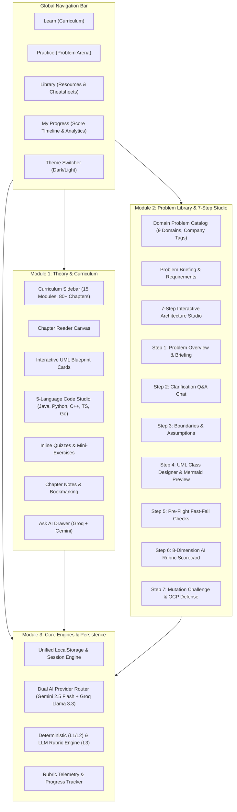
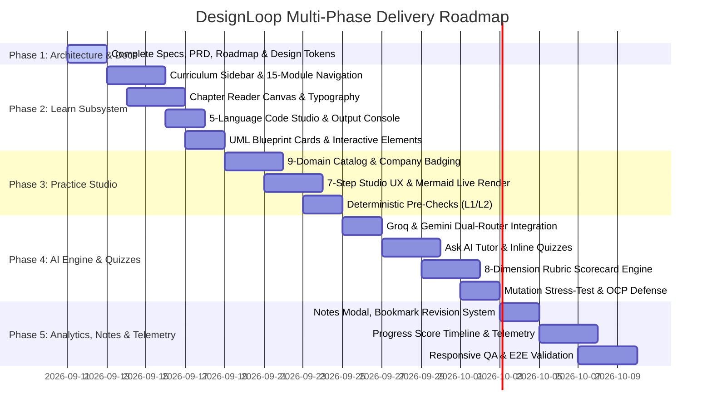

# Master Roadmap & Technical Specification

## Executive Summary

This specification outlines the phased development and production architecture of **DesignLoop** — a platform that unites structured curriculum learning with a hands-on 7-step architectural practice studio and schema-constrained AI evaluation.

---

## 1. System Architecture

---

## 2. Delivery Roadmap

---

## 3. Component Hierarchy

### Learn Mode (3 Columns + Top Nav + Bottom Dock)

1. **Top Navigation (`TopNav.tsx`)** — Brand logo, primary tabs (Learn, Practice, Library, Progress), theme toggle, user profile badge.
2. **Left Column (`CurriculumSidebar.tsx`)** — Progress counter, chapter search, 15 module accordions with badge counters, chapter status indicators (unread, active, completed, starred, quiz).
3. **Center Column (`ChapterReader.tsx`)** — Priority badge, read time, last updated; markdown reader; UML Blueprint Cards; 5-language Code Studio with simulated output; real-world case study; inline quizzes.
4. **Right Column (`ChapterTOC.tsx`)** — `On this page` heading index with active scroll spy; reading progress indicator; resources widget.
5. **Bottom Dock (`BottomActionBar.tsx`)** — Previous/Next chapter, Notes modal, Star/Bookmark, Mark Complete, Ask AI drawer, Font Size toggle.

---

### Practice Mode (Problem Library & 7-Step Studio)

1. **Problem Library (`ProblemLibrary.tsx`)** — Domain filter tabs, difficulty pills, company logos, search bar, and completion status toggles.
2. **Problem Overview (`ProblemOverview.tsx`)** — Full-page briefing with functional requirements, non-functional constraints, and CTA to start the studio.
3. **7-Step Studio (`DesignWorkspace.tsx`)**:
   - Step 1: Overview
   - Step 2: Clarification Q&A
   - Step 3: Assumptions Registry
   - Step 4: Visual UML Class Designer + Live Mermaid Diagram
   - Step 5: Fast-Fail Structural Validation
   - Step 6: 8-Dimension AI Rubric Scorecard
   - Step 7: Mutation Scenario Defense

---

## 4. Non-Functional Requirements

- **Performance** — Vite-optimized build with sub-second HMR and lightweight bundle splitting.
- **State Resilience** — LocalStorage schema versioning with automatic migrations.
- **AI Latency** — <1.5s for interactive chat via Groq; <4s for rubric evaluations via Gemini.
- **Accessibility** — WCAG AAA compliant contrast ratios across dark and light themes.
