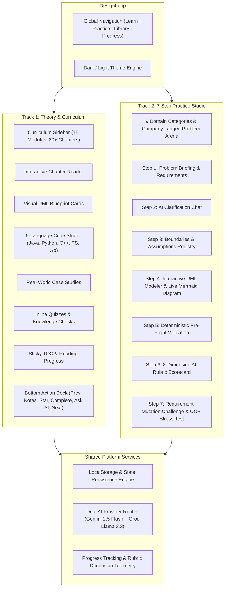

# Product Requirements Document

## 1. Vision

**DesignLoop** is a Low-Level Design (LLD) and Object-Oriented Architecture learning platform for software engineers preparing for senior and staff engineering interviews. It combines a rich theory curriculum with a hands-on 7-step architectural practice studio backed by dual-AI evaluation.

---

## 2. Feature Specifications

### Learn Experience

1. **Curriculum Sidebar (Left, 280px)**
   - Overall course completion header with module fraction.
   - Real-time chapter search.
   - 15 collapsible module accordions with completion counters.
   - Visual indicators for active, completed, starred, and quiz-type chapters.

2. **Chapter Reader (Center Canvas)**
   - Priority badge, read time estimate, and last updated timestamp.
   - Markdown content with callout boxes, definitions, and analogies.
   - UML Class Blueprint Cards with access modifiers, fields, and method signatures.
   - Multi-language Code Studio: Java, Python, C++, TypeScript, Go — with line numbers, copy-to-clipboard, and simulated output console.
   - Real-world case study with trade-off analysis.
   - Inline quizzes and interactive knowledge checks.

3. **Sticky TOC & Progress (Right, 240px)**
   - `On this page` section navigator with scroll-position highlighting.
   - Real-time reading progress bar.
   - Quick action links.

4. **Bottom Floating Action Bar**
   - `< Previous Chapter` / `Next Chapter >` navigation.
   - `Notes` — persistent per-chapter markdown notes modal.
   - `Star` — bookmark chapters for quick revision.
   - `Mark as Complete` — updates module progress and syllabus tracking.
   - `Ask AI` — slide-out AI tutor drawer pre-populated with chapter context.
   - `Font Size (Aa)` — typography scaling.

---

### Practice Experience

1. **Problem Catalog**
   - 9 domain categories: Games & Puzzles, Data Structures & Search, Managing States, Management Systems, Social & Content Platforms, Communication & Messaging, Financial & Payment Systems, E-Commerce & Booking, Developer Tools & Infrastructure.
   - Problem cards with difficulty pills, estimated time, and company logo badges (Google, Amazon, Meta, Microsoft, Uber, Netflix).

2. **7-Step Practice Studio**
   - **Step 1 — Problem Overview**: Functional requirements, non-functional constraints, and structural considerations.
   - **Step 2 — Clarification**: Chat with an AI interviewer to discover hidden requirements.
   - **Step 3 — Assumptions**: Record explicit boundary conditions and domain invariants.
   - **Step 4 — UML Class Designer**: Visual class, attribute, and method builder with live Mermaid diagram.
   - **Step 5 — Pre-Flight Checks**: Deterministic Layer 1 & 2 validation (referential integrity, inheritance, syntax).
   - **Step 6 — AI Rubric Scorecard**: 8-dimension architectural grading with direct evidence quotes and actionable suggestions.
   - **Step 7 — Mutation Challenge**: Live scenario change injection to test Open-Closed Principle adherence.

---

## 3. Technical Architecture & AI Orchestration

- **Dual AI Provider**:
  - **Groq (Llama 3.3 70B)** — Ultra-low latency for interactive chat, clarification Q&A, and inline chapter tutor.
  - **Google Gemini (Gemini 2.5 Flash)** — Schema-constrained structured output for deep rubric evaluation and mutation verification.
- **Local Persistence**:
  - LocalStorage stores chapter progress, notes, drafts, submissions, attempt snapshots, and settings.
  - Offline-first resilience to ensure zero data loss during network hiccups.

---

## 4. Success Metrics

- **Learning Retention** — >85% completion rate on OOP & SOLID modules.
- **Practice Engagement** — Average candidate completes ≥3 full 7-step practice problems.
- **Evaluation Accuracy** — Deterministic validator catches 100% of structural errors before AI evaluation; rubric scoring achieves >90% consistency across repeated evaluations.
