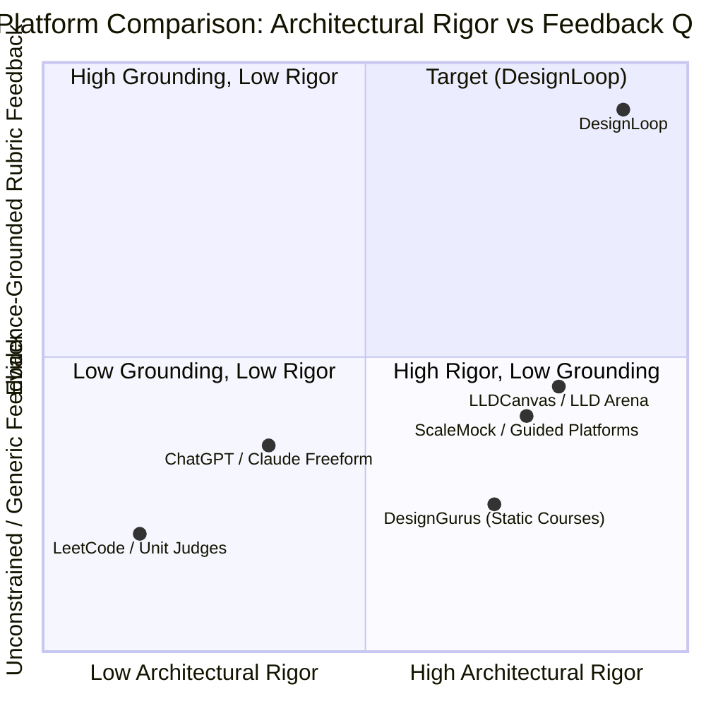
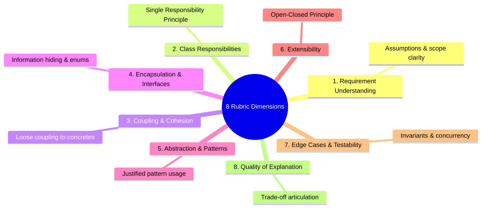

# Research Summary & Pedagogical Foundations

This document summarizes the current state of LLD interview preparation, surveys existing platforms, and details the pedagogical principles behind DesignLoop.

---

## 1. The Learner Problem

Most engineers prepare for LLD interviews through an inefficient, unguided loop:

1. Read a prompt (e.g. *"Design a Parking Lot"* or *"Design Splitwise"*).
2. Sketch classes on scratchpad paper or Excalidraw.
3. Write code locally in an IDE.
4. Compare against a static video editorial or blog post.

### Four Critical Failure Modes

- **No clear feedback beyond "it compiles"** — Traditional online judges only verify unit test assertions. They cannot detect a 1,000-line God class with 15 nested `switch` statements.
- **Multiple valid solutions are ignored** — Editorials present a single "golden" diagram as the only correct answer, ignoring trade-offs between Strategy patterns, polymorphism, or state machines.
- **No improvement loop** — After an attempt, learners receive no structured revision targets for their next iteration.
- **No evidence retention** — Platforms rarely persist what the learner actually designed, making it impossible to measure architectural growth over time.

---

## 2. Survey of Existing Platforms

| Platform | Practice Workflow | Feedback Mechanism | Critical Limitation |
| :--- | :--- | :--- | :--- |
| **ScaleMock** | Select problem → Built-in IDE/diagram → Upload | AI Score (unconstrained) | Scores lack rubric grounding; no extensibility testing against requirement mutations. |
| **Guided Course Platforms** | Step-by-step guided flow → Text + code | Hints & editorial comparison | Encourages memorizing standard solutions rather than defending a design. |
| **DesignGurus** | Read → Whiteboard → Course walkthrough | Static video editorial | Passive learning; no automated evaluation or feedback loop. |
| **LLDCanvas / LLD Arena** | Monaco editor → Java compilation → UML → Tests | AI grading + test harness | Heavy focus on code compilation over architectural reasoning; single reference solution bias. |
| **Unconstrained AI (ChatGPT)** | Prompt: *"Review my LLD classes"* | Freeform affirmation | **Sycophancy trap** — Hallucinates requirements; fails to enforce SOLID rubrics. |

---

## 3. Why Structured Text Design for the MVP?

| Format | What It Proves | Build Effort | Best Fit |
| :--- | :--- | :---: | :--- |
| **Structured Text Design** | Requirements, assumptions, classes, responsibilities, and design rationale | Low | MVP — provides 100% of architectural signal needed for rubric evaluation |
| **Full Code Execution** | Syntax, compilation, test harness execution | Very High | Machine coding rounds (requires Docker sandboxing, process timeouts, multi-language tooling) |
| **Diagram Canvas** | Spatial layout, visual arrows, boxes | High | Visual learners — but consumes ~70% of build effort on canvas math rather than evaluation quality |

**Our approach:** Standardize on **Structured Text Design Evidence** (classes, methods, invariants, relationships, rationale) paired with a live **Mermaid.js class diagram preview**. This provides clean, machine-readable data for deterministic validation while delivering instant visual clarity.

---

## 4. The 8-Dimension Evaluation Rubric

Instead of an arbitrary single number, DesignLoop evaluates designs across 8 explicit dimensions on a 1-to-5 scale.

| Criterion | What It Measures | Target Evidence |
| :--- | :--- | :--- |
| **1. Requirement Understanding** | Did the candidate state clear assumptions and define system boundaries? | *"Assumes duration-based pricing computed at checkout."* |
| **2. Class Responsibilities** | Does each class have one focused reason to change? | *"ParkingSpot tracks size and availability only."* |
| **3. Coupling & Cohesion** | Are high-level orchestrators decoupled from concrete dependencies? | *"ParkingLot depends on FeeStrategy interface rather than concrete classes."* |
| **4. Encapsulation & Interfaces** | Are internal collections and states hidden behind safe public methods? | *"VehicleType is an enum; internal spot list is unmodifiable."* |
| **5. Abstraction & Patterns** | Are design patterns justified by actual variation points (no cargo-culting)? | *"Strategy pattern applied for spot allocation algorithms."* |
| **6. Extensibility** | Can the architecture absorb new requirements with minimal edits? | *"Adding EV charging requires only an EVSpot subclass and FeeStrategy implementation."* |
| **7. Edge Cases & Testability** | Are invalid states and boundary conditions handled? | *"Full parking lot handled via entrance display board check."* |
| **8. Quality of Explanation** | Can the candidate articulate why an abstraction was chosen and its trade-offs? | *"Explains why composition was chosen over inheritance."* |

---

## 5. Architectural Innovations in DesignLoop

1. **Store-Before-Execute Guarantee** — Submissions are persisted in state `SUBMITTED` before the evaluation pipeline runs. Zero learner work is lost on AI provider drops.
2. **Deterministic Fast-Fail Gating** — Layer 1 & 2 checks verify referential integrity in <10ms with zero AI token cost.
3. **Requirement Mutation Challenge** — Measures extensibility empirically by calculating the Change Cost when a follow-up requirement change is injected.
4. **Side-by-Side Diff Lab (v1 ↔ v2)** — Visualizes architectural evolution across attempts and prompts metacognitive self-explanation.
