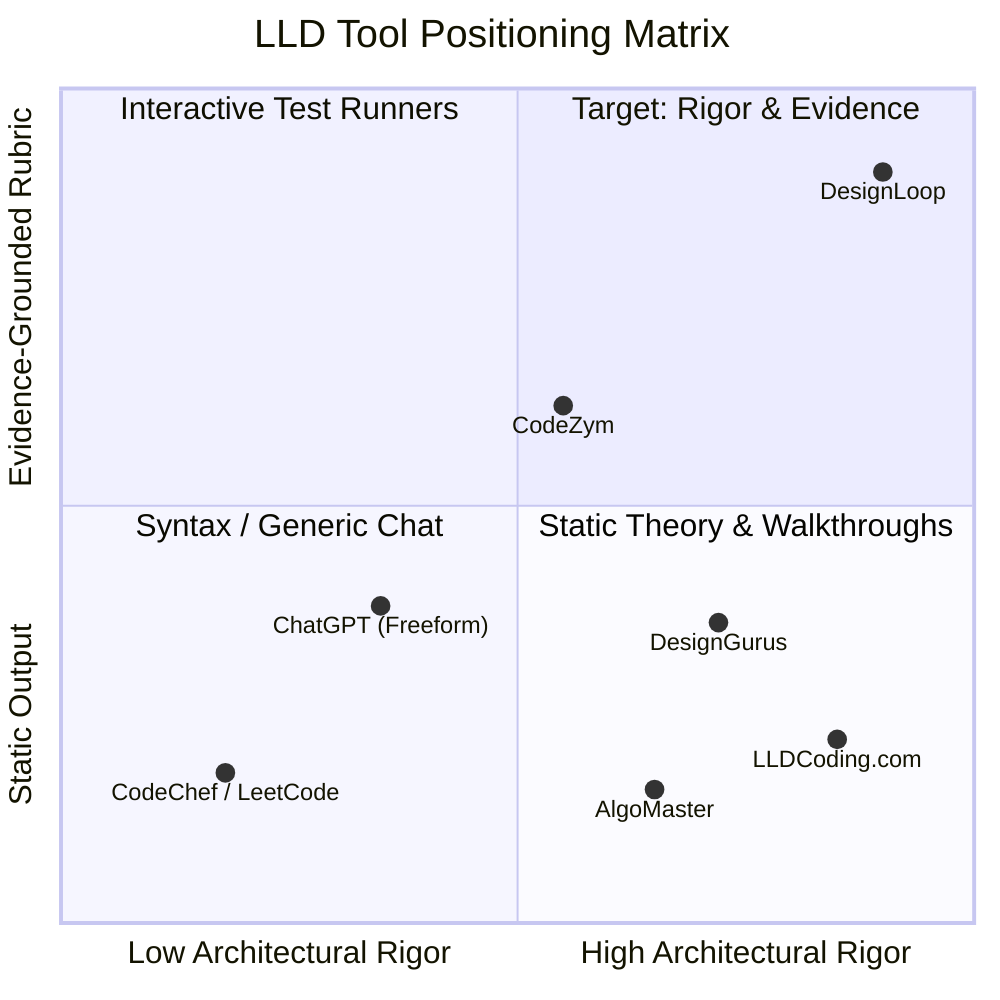
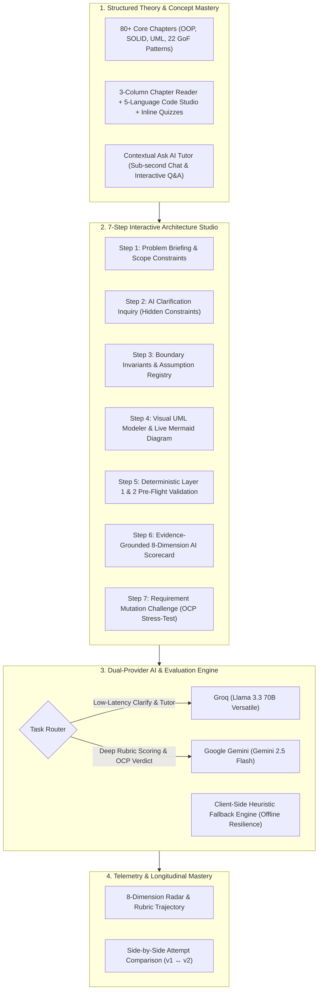

# Research Note: Low-Level Design Learning & Evaluation Platforms

## Executive Summary

Low-Level Design (LLD) and Object-Oriented Architecture have become mandatory screening rounds for Mid, Senior, and Staff engineering roles at top tech companies. While algorithms (DSA) and High-Level Design (HLD) have mature preparation ecosystems, LLD preparation remains broken, fragmented, and passive. 

This research note investigates the **learner problem**, analyzes **existing market tools** (AlgoMaster, CodeChef, CodeZym, LLDCoding.com, DesignGurus, and generic LLMs), identifies **systemic architectural gaps**, and articulates **DesignLoop's product direction**.



| Quadrant | Focus & Tool Archetype | Representative Platforms |
| :--- | :--- | :--- |
| **Q1: Target (High Rigor + Evidence Rubric)** | 7-Step studio, live UML modeling, evidence-grounded rubric, mutation stress-testing | **DesignLoop** |
| **Q2: Interactive Test Runners (Lower Rigor)** | In-browser IDEs focused on unit tests and code compilation | **CodeZym** |
| **Q3: Algorithmic / Generic Chat (Low Rigor)** | Competitive programming test cases or unconstrained conversational prompts | **CodeChef, LeetCode, ChatGPT** |
| **Q4: Static Theory & Repos (High Rigor, No Feedback)** | Visual newsletters, video walkthroughs, and static solution repositories | **AlgoMaster, LLDCoding, DesignGurus** |

---

## 1. The Learner Problem

Engineers preparing for LLD interviews experience a major cognitive disconnect between writing algorithmic code and structuring maintainable object-oriented systems:

1. **The "It Compiles" Fallacy:** Traditional online judges only check if code produces the correct standard output for sample inputs. A candidate can write a single 1,200-line God class filled with static state, tight coupling, and 18 nested `switch` statements and still pass unit tests. In an interview, that same design results in an immediate reject.
2. **The "Golden Solution" Trap:** Most tutorials present a single "author's solution" as the only correct architecture. Candidates memorize specific class diagrams (e.g., standard Parking Lot) rather than learning how to identify variation points, encapsulate state, and defend design trade-offs when constraints change.
3. **Passive Theory vs. Active Modeling Gap:** Engineers read about SOLID principles, GoF design patterns, and UML diagrams in blogs or newsletters, but struggle to apply them systematically when faced with an open-ended interview prompt.
4. **Absence of Mutation Resilience:** Real-world software and senior-level interviews test how easily an architecture absorbs change. Candidates rarely practice stress-testing their designs against follow-up requirement mutations (the Open/Closed Principle).
5. **Lack of Evidence-Grounded Feedback:** When candidates ask peers or generic AI for review, they receive vague praise or unstructured commentary rather than objective, rubric-grounded critique tied directly to their design decisions.

---

## 2. Competitive Landscape & Tool Analysis

| Platform / Tool | Core Value Proposition | Strengths | Critical Gaps & Failure Modes |
| :--- | :--- | :--- | :--- |
| **AlgoMaster** | Visual newsletters, curated cheatsheets, and concept deep-dives. | Exceptional visual diagrams, intuitive pattern explanations, and approachable theory. | **Passive consumption only.** No interactive modeling canvas, no submission evaluation, and no personalized diagnostic feedback. |
| **CodeChef / LeetCode** | Algorithmic problem arena, competitive programming, and MCQ practice. | Large problem catalog, instant test execution, and competitive community benchmarking. | **Architecturally blind.** Evaluates time/space complexity and I/O correctness; cannot evaluate SRP, coupling, encapsulation, or pattern trade-offs. |
| **[CodeZym](https://codezym.com/)** | Machine coding platform with in-browser IDE and automated test suites. | Hands-on coding environment, timed execution, and realistic boilerplate setups. | **Over-indexes on implementation syntax over architectural design.** Focuses on passing unit test suites rather than structural modeling, boundary assumptions, and design rationale. |
| **[LLDCoding.com](https://www.lldcoding.com/)** | Curated catalog of interview problems with code solutions and design pattern articles. | Comprehensive coverage of popular interview questions (Splitwise, Elevator, Snake & Ladder) with multi-language code. | **Static editorial repository.** No interactive practice studio, no AI critique, no validation of candidate-created designs, and no revision loops. |
| **DesignGurus / Educative (Grokking LLD)** | Structured text/video courses walking through standard problem designs. | High-quality baseline content, clear requirements breakdown, and standard class diagrams. | **Rote memorization bias.** Fixed reference architecture with zero evaluation of alternative candidate designs; high cost with zero interactive feedback. |
| **Generic LLMs (ChatGPT / Claude Prompts)** | Freeform chat prompt: *"Review my class design for Parking Lot"*. | Conversational flexibility and instant generation of boilerplate code. | **Sycophancy & Hallucination.** Unconstrained AI affirms poor designs without applying strict rubrics; lacks structured state management and deterministic validation. |

---

## 3. Key Market Gaps

Synthesizing the research across existing tools reveals five foundational gaps in the LLD preparation market:

```
┌────────────────────────────────────────────────────────────────────────────────────────┐
│                                FIVE SYSTEMIC GAPS                                      │
├────────────────────────────┬────────────────────────────┬──────────────────────────────┤
│ 1. Structural vs. Syntax   │ 2. Single Reference vs.    │ 3. Static vs. Dynamic        │
│    Judges test compilation │    Trade-off Exploration   │    Requirements (OCP)        │
│    not cohesion/coupling.  │    Ignore valid variants.  │    No mutation testing.      │
├────────────────────────────┴────────────────────────────┴──────────────────────────────┤
│ 4. Passive Reading vs. Guided Architectural Workflow (No 7-step studio)                │
│ 5. Unconstrained Hallucinations vs. Grounded Rubric Evaluation with Direct Evidence    │
└────────────────────────────────────────────────────────────────────────────────────────┘
```

1. **The Evaluation Gap:** Automated tools either execute unit tests (CodeZym/CodeChef) or offer unstructured conversational chat (ChatGPT). Neither provides a structured, multi-dimensional rubric scorecard.
2. **The Workflow Gap:** Candidates jump directly into writing classes without clarifying ambiguity, defining boundary invariants, or capturing non-functional constraints.
3. **The Extensibility Gap:** No existing platform tests whether a candidate's design adheres to the Open/Closed Principle by injecting runtime requirement mutations.
4. **The Telemetry & Growth Gap:** Existing platforms do not track historical dimension mastery (e.g., identifying that a candidate consistently struggles with *Loose Coupling* across attempts).

---

## 4. Product Direction: The DesignLoop Blueprint

DesignLoop solves these gaps by integrating **structured curriculum learning** with a **7-step interactive architecture studio** and an **evidence-grounded dual-AI evaluation pipeline**.



### Core Architectural Pillars

1. **Structured 7-Step Interview Simulation:** Replicates the exact cognitive progression of a real tech interview: clarifying constraints → stating invariants → modeling domain entities → validating integrity → receiving critique → defending against requirement mutations.
2. **Evidence-Grounded 8-Dimension Rubric:** Submissions are evaluated against explicit architectural criteria (*Requirement Understanding, Class Responsibilities/SRP, Coupling & Cohesion, Encapsulation & Interfaces, Patterns & Abstraction, Extensibility, Edge Cases & Testability, Quality of Explanation*). Every score cites **direct evidence quotes** from candidate decisions.
3. **Requirement Mutation Stress-Test (OCP):** After submission, the system injects a live scenario shift (e.g., *"Introduce Dynamic Surge Pricing and VIP Reserved Spots"*), measuring the design's Change Cost and returning an empirical OCP verdict.
4. **Deterministic + Dual-AI Architecture:**
   - **Deterministic Layer (<10ms):** Fast-fail validation for structural integrity, syntax, and state transitions with zero token cost.
   - **Low-Latency AI (Groq Llama 3.3):** Sub-second clarification chat, inline quizzes, and tutor assistance.
   - **Deep Reasoning AI (Gemini 2.5 Flash):** High-precision rubric evaluation and mutation reasoning constrained by strict JSON schemas.
   - **Offline Heuristic Engine:** Guarantees candidates never lose work or hit blocking errors even during total API provider outages.
5. **Zero-Mock Longitudinal Telemetry:** Tracks authentic candidate growth over time, highlighting specific weak architectural dimensions and recommending tailored practice problems.

---

## 5. Summary & Strategic Advantage

| Dimension | Legacy Tools (AlgoMaster, CodeChef, CodeZym, LLDCoding) | DesignLoop |
| :--- | :--- | :--- |
| **Learning Model** | Passive reading or isolated unit-test execution | Unified theory-to-practice studio |
| **Problem Solving** | Jump directly to code or copy static diagrams | 7-step interview workflow with live UML modeling |
| **Evaluation Mode** | Pass/Fail unit tests or generic chatbot text | Structured 8-dimension rubric with direct evidence citations |
| **Change Resilience** | Completely unaddressed | Automated requirement mutation stress-testing |
| **Feedback Latency & Reliability** | High latency or fragile single-API setups | Dual-provider routing (Groq + Gemini) with offline fallback |
| **Progress Tracking** | Binary problem completion checkmarks | Longitudinal rubric telemetry and dimension growth |

DesignLoop elevates Low-Level Design preparation from static rote memorization to active, evidence-based architectural mastery.
